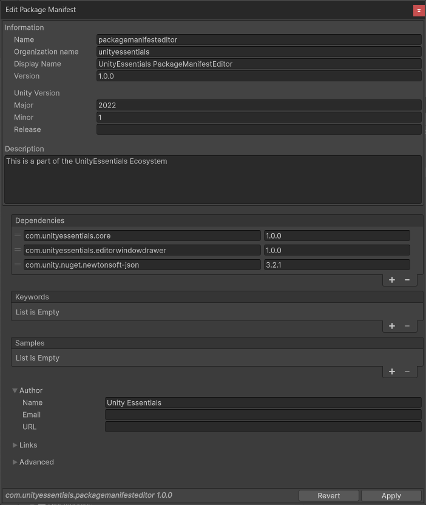

# Unity Essentials

This module is part of the Unity Essentials ecosystem and follows the same lightweight, editor-first approach.
Unity Essentials is a lightweight, modular set of editor utilities and helpers that streamline Unity development. It focuses on clean, dependency-free tools that work well together.

All utilities are under the `UnityEssentials` namespace.

```csharp
using UnityEssentials;
```

## Installation

Install the Unity Essentials entry package via Unity's Package Manager, then install modules from the Tools menu.

- Add the entry package (via Git URL)
  - Window → Package Manager
  - "+" → "Add package from git URL…"
  - Paste: `https://github.com/CanTalat-Yakan/UnityEssentials.git`

- Install or update Unity Essentials packages
  - Tools → Install & Update UnityEssentials
  - Install all or select individual modules; run again anytime to update

---

# Package Manifest Editor

> Quick overview: Edit `package.json` files inside Unity with a focused editor window: name/display name, version, Unity version, dependencies, keywords, samples, author, links, and advanced flags.

A small editor utility that opens a purpose-built inspector for `package.json`. It lets you edit the most common fields with sane defaults, re-orderable lists for dependencies/keywords/samples, and immediate save/revert actions.



## Features
- Context-aware: enabled only when a `package.json` is selected in the Project window
- Name composer: split/compose `com.<organization>.<package>` with automatic sanitation
- Common fields: Display Name, Version, Description
- Unity version editor: Major, Minor, and Release (`unity` + `unityRelease`)
- Dependencies editor: re-orderable list of `name` + `version` pairs
- Keywords editor: re-orderable list of strings
- Samples editor: re-orderable entries with Display Name, Description, and Path (defaults to `Samples~/`)
- Author block: Name, Email, URL
- Links block: Documentation, Changelog, and Licenses URLs
- Advanced: `hideInEditor` toggle with inline help
- Apply/Revert: write changes to disk or discard and reload

## Requirements
- Unity Editor 6000.0+ (Editor-only; no runtime code)
- Newtonsoft.Json (Unity includes `com.unity.nuget.newtonsoft-json` by default in recent versions)

Tip: If the tool window doesn’t open, make sure you have an actual `package.json` file selected in the Project window.

## Usage
1) In the Project window, select a `package.json` file you want to edit
2) Open: Assets → Edit Package Manifest
3) Update fields as needed:
   - Organization + Package name (auto-composed into `com.<org>.<package>`)
   - Display Name, Version, Description
   - Unity Version (Major/Minor) and Release
   - Dependencies, Keywords, Samples (add/remove/reorder)
   - Author and Links
   - Advanced: Hide In Editor
4) Click Apply to write the updated JSON to disk and refresh the Asset Database
5) Click Revert to reload from disk and discard unsaved changes

## Menu Commands
- Assets → Edit Package Manifest
  - Opens the editor window for the currently selected `package.json`
  - Enabled only when the active selection is a file named `package.json`

Selection logic: Select any `package.json` in the Project window to enable the menu.

## How It Works
- Loads the selected file into a `PackageManifestData` model
- Parses the existing `name` to extract `organization` and `package` parts; composes it as `com.<org>.<package>`
- Uses re-orderable lists for Dependencies, Keywords, and Samples
- Writes back to disk (pretty-printed JSON) on Apply and refreshes the Asset Database
- Provides Revert to re-read from disk and reset the UI

## Notes and Limitations
- Scope: Edits a single `package.json` at a time; bulk editing is not supported
- Validation: Basic sanitation for org/package name parts; no deep schema validation beyond the provided fields
- Defaults:
  - Unity version defaults to `2022.1` if missing; you can edit Major/Minor separately and Release as text
  - Samples default path is `Samples~/`
  - New dependency defaults to name `com.example.new-package` with version `1.0.0` (editable)
- Editor-only: This module contains no runtime components

## Files in This Package
- `Editor/PackageManifest.cs` – Data model, UI lists, helpers, save/parse logic
- `Editor/PackageManifestEditor.cs` – Window creation, menu item, layout (Header/Body/Footer)
- `Editor/UnityEssentials.PackageManifest.Editor.asmdef` – Editor assembly definition

## Tags
unity, unity-editor, upm, package, manifest, package.json, dependencies, keywords, samples, author, links, editor-tool, workflow
